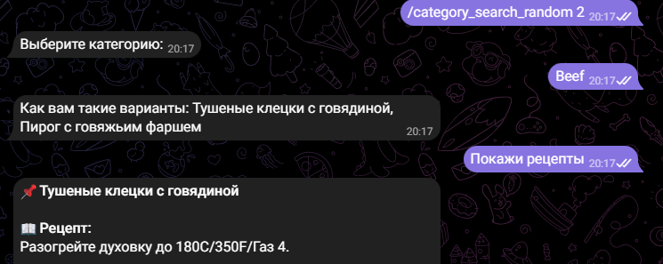
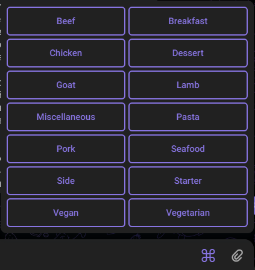

# Telegram-бот «Информация о рецептах»

## Содержание

- [Описание](#описание)
- [Установка, настройка и запуск](#установка,-настройка-и-запуск)
- [Файловая структура](#файловая-структура)
- [Демонстрация](#демонстрация)

## Стек технологий
- python 3.8
- asyncio
- aiohttp
- aiogram 3.10

## Описание
Telegram-бот предоставляющий информацию о рецептах ингредиентах и категориях блюд из API themealdb.
Стартовой точкой является ввод **количества** рецептов, которые пользователь хочет получить.
Дплее бот предложит выбрать категорию и даст наименование случайных блюд которые он выбрал из 
списка всех рецептов данной категории. После чего, если пользователь нажмет кнопку **"Показать рецепты"**,
отобразит каждый рецепт в отдельном сообщении.

#### Промер корректного диалога с ботом

Категории отображаются в виде кнопок. Наименования категорий сохраняются так, как они были получены
от сервиса themealdb.com \

А Текст рецептов, ингредиентов, наименований блюд, переведены с помощью библиотеки googletrans.

## Установка, настройка и запуск
1. Убедитесь, что у вас установлен python версии 3.8.
2. Клонируйте этот репозиторий: `https://github.com/SvetlanaKrasnova/telegram_bot_info_recipes.git`
3. Установить необходимые библиотеки из файла requirements.txt `pip install -r requirements.txt`
4. В файле config\token_data пропишите свой токен бота.
5. Запустите проект: `python bot_main.py`

## Файловая структура
~~~python
telegram_bot_info_recipes/
├── config/
│   └── token_data.py
├── files/ # Файлы для README.md
│   └── files_readme/
│       ├── buttons_categories.png
│       └── dialog_bot.png
├── interfaces/
│   ├── api_themealdb.py # описание взаимодействия с API themealdb
│   └── models.py # Модели ответов API themealdb
├── README.md
├── recipes_handler.py # функции, описывающие диалог с ботом
├── requirements.txt
├── utils/
│   ├── button_start.py # Кнопки для команды /start
│   └── suffix_text_meals.py # дополнительный функционал для форматирования текста
└── bot_main.py
~~~

## Демонстрация
